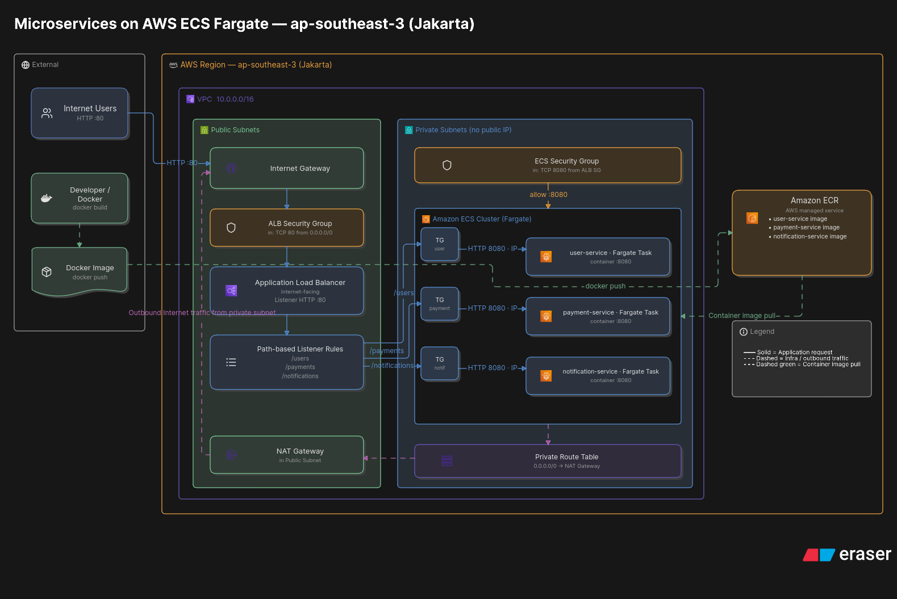

# AWS Microservices Architecture

## Overview

This project demonstrates a production-inspired microservices architecture built on AWS as a hands-on learning project.

The application consists of three independent microservices:

* **User Service**
* **Payment Service**
* **Notification Service**

Each service is containerized using Docker and deployed independently using **Amazon ECS with AWS Fargate**.

**Amazon ECR** is used as the container image registry, while an **Application Load Balancer (ALB)** acts as the public entry point and routes HTTP requests to the appropriate microservice using path-based routing.

---

## Architecture Diagram

The following diagram illustrates the overall AWS architecture, including the VPC, public and private subnets, ALB, ECS Fargate tasks, ECR, and traffic flow.



---

## AWS Services

| Service                       | Purpose                                                     |
| ----------------------------- | ----------------------------------------------------------- |
| **Amazon VPC**                | Provides an isolated network environment                    |
| **Internet Gateway**          | Provides Internet connectivity for public subnets           |
| **Application Load Balancer** | Provides the public entry point and HTTP path-based routing |
| **Amazon ECS**                | Provides container orchestration                            |
| **AWS Fargate**               | Runs containers without managing EC2 servers                |
| **Amazon ECR**                | Stores Docker container images                              |
| **Target Groups**             | Routes ALB traffic to ECS Fargate tasks                     |
| **Security Groups**           | Controls network access between components                  |
| **NAT Gateway**               | Provides outbound Internet access from private subnets      |

---

## Network Architecture

The application uses an Amazon VPC with separate public and private subnets.

### VPC

```text
VPC
CIDR: 10.0.0.0/16
Region: ap-southeast-3 (Jakarta)
```

### Public Subnets

The following components are placed in public subnets:

* Internet-facing Application Load Balancer
* NAT Gateway

### Private Subnets

ECS Fargate tasks are deployed in private subnets.

The Fargate tasks:

* Do not have public IP addresses
* Are not directly accessible from the Internet
* Receive application traffic through the Application Load Balancer

The intended traffic flow is:

```text
Internet
    |
    | HTTP :80
    v
Application Load Balancer
    |
    | HTTP :8080
    v
ECS Fargate Tasks
```

---

## Application Routing

The Application Load Balancer uses **HTTP path-based routing** to forward requests to different microservices.

The current routing configuration is:

```text
/user
    |
    v
user-service Target Group
    |
    v
user-service Fargate :8080


/payment
    |
    v
payment-service Target Group
    |
    v
payment-service Fargate :8080


/notification
    |
    v
notification-service Target Group
    |
    v
notification-service Fargate :8080
```

Each microservice has its own Target Group.

### Routing Summary

| Path            | Target Group         | Service              | Container Port |
| --------------- | -------------------- | -------------------- | -------------: |
| `/user`         | user-service         | User Service         |           8080 |
| `/payment`      | payment-service      | Payment Service      |           8080 |
| `/notification` | notification-service | Notification Service |           8080 |

---

## Security

The architecture uses separate Security Groups for the Application Load Balancer and ECS Fargate tasks.

### ALB Security Group

The ALB Security Group allows inbound HTTP traffic from the Internet:

```text
Protocol: HTTP
Port: 80
Source: 0.0.0.0/0
```

### ECS Security Group

The ECS Security Group allows application traffic only from the ALB Security Group:

```text
Protocol: TCP
Port: 8080
Source: ALB Security Group
```

Therefore, users on the Internet cannot directly access the ECS Fargate tasks.

The traffic flow is:

```text
Internet
    |
    | HTTP :80
    v
ALB Security Group
    |
    | TCP :8080
    v
ECS Security Group
    |
    v
Fargate Tasks
```

This design keeps the application containers inside private subnets while exposing only the Application Load Balancer to the Internet.

---

## Container Image Flow

Each microservice is packaged as a Docker image.

The images are pushed to Amazon ECR and then referenced by the ECS task definitions when launching Fargate tasks.

```text
Source Code
    |
    v
Docker Build
    |
    v
Docker Image
    |
    v
Amazon ECR
    |
    v
ECS Fargate
    |
    v
Running Container
```

The project currently uses the `latest` image tag.

The three ECR repositories contain images for:

```text
user-service
payment-service
notification-service
```

---

## Why ECS Fargate?

ECS with Fargate was selected instead of EKS because the current project does not require Kubernetes-specific capabilities.

Fargate allows containers to run without managing EC2 instances.

This keeps the architecture simpler while still providing:

* Container orchestration
* Service management
* Task deployment
* Horizontal scaling capabilities

EKS would be considered when Kubernetes-specific capabilities, an existing Kubernetes platform, or Kubernetes portability are required.

---

## Why Application Load Balancer?

An Application Load Balancer was selected because the architecture requires HTTP-based routing between multiple microservices.

The ALB provides path-based routing so that different requests can be forwarded to different Target Groups.

For example:

```text
/user          → user-service
/payment       → payment-service
/notification  → notification-service
```

This allows multiple microservices to share a single public entry point instead of exposing each ECS service directly to the Internet.

---

## Health Checks

Each Target Group uses the `/health` endpoint to verify the health of its ECS Fargate tasks.

```text
ALB
 |
 +--> user Target Group
 |       |
 |       +--> GET /health → HTTP 200
 |
 +--> payment Target Group
 |       |
 |       +--> GET /health → HTTP 200
 |
 +--> notification Target Group
         |
         +--> GET /health → HTTP 200
```

Only healthy targets receive traffic from the ALB.

---

## Current Deployment Status

The infrastructure and application deployment have been successfully verified.

```text
ECS Services

user-service          1/1 Running
payment-service       1/1 Running
notification-service  1/1 Running
```

Target Group health:

```text
user          Healthy
payment       Healthy
notification  Healthy
```

The ALB path-based routing has also been tested successfully.

---

## Infrastructure as Code

The AWS infrastructure is managed using **Terraform**.

The Terraform project is maintained separately from the application repository.

### Application Repository

`pandunur/aws-microservices-devops`

### Terraform Repository

`pandunur/aws-microservices-terraform`

This separation keeps application code and infrastructure code independently managed.

---

## Project Scope

This project focuses on practicing:

* AWS networking
* VPC design
* Public and private subnets
* Security Groups
* Docker containerization
* Amazon ECR
* Amazon ECS
* AWS Fargate
* Application Load Balancer
* Target Groups
* Path-based routing
* CloudWatch Logs
* IAM
* Terraform

GitHub Actions CI/CD and OIDC are intentionally outside the current scope of this project.

---

## Future Improvements

Possible future improvements include:

* Database per microservice
* AWS Secrets Manager
* GitHub Actions CI/CD
* GitHub OIDC authentication
* Immutable image tags instead of `latest`
* ECS service auto scaling
* HTTPS with ACM
* Custom domain
* Centralized monitoring and alerting

---

## Related Repository

**Application**

`https://github.com/pandunur/aws-microservices-devops`

**Infrastructure**

`https://github.com/pandunur/aws-microservices-terraform`
